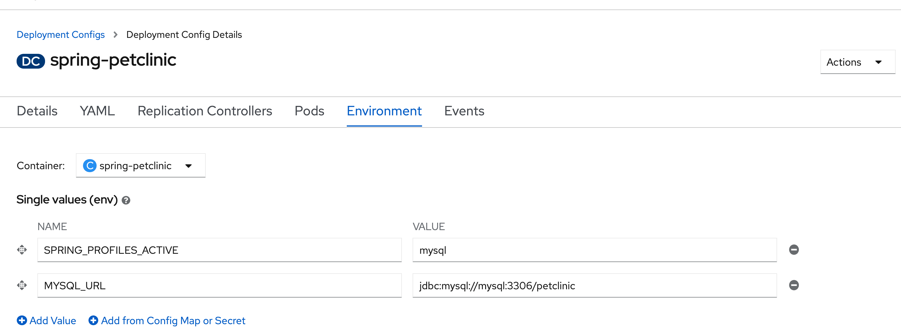

# Spring Pet Clinic 

Este repositorio contiene una implementación lista para contenedores de la clasica aplicación Spring Petclinic. Específicamente, este código es útil con la tecnología OpenShift Source-to-Image (s2i) y es parte del material introductorio de [Developer Sandbox for Red Hat OpenShift](https://developers.rehat.com/developer-sandbox).


## Consola de desarrollo

Asegúrese de estar en la perspectiva de desarrollador:


Y crear una nueva instancia de MySQL haciendo click en `+Add` y eligiendo la opcion: `Database`


Escoger MySQL Ephemeral:


Y hacer click en `Instantiate Template`.

A continuación, complete los espacios con los siguientes parámetros:


Apretar el boton de  `Create` .

Estamos utilizando una implementación **Ephemeral** porque esta es una demostración de corta duración y no necesitamos retener los datos. 

En un sistema de producción, lo más probable es que utilice una instancia de MySQL permanente. Esto almacena los datos en un volumen persistente (básicamente un disco duro virtual), lo que significa que el pod de MySQL puede destruirse y reemplazarse con los datos que permanecen intactos.

### Desplegar la Pet Clinic App


Click the `+Add` button and choose `From Git` type:

Fill the git repo with the following value `https://github.com/redhat-developer-demos/spring-petclinic` and select the project as Java project:


Apretar en `Build Configuration` 


Añadir las siguientes variables de entorno :

```
SPRING_PROFILES_ACTIVE=mysql
MYSQL_URL=jdbc:mysql://mysql:3306/petclinic
```



Finalmente apretar el boton `Create` y espere hasta que finalice la Build y el Pod esté en funcionamiento (azul oscuro alrededor de la burbuja de implementación).

Luego apretamos el boton de Open URL  para ver la Pet Clinic app:


Y si vamos a la Terminal de la implementación de MySQL, se peude conectar a la base de datos para ver el esquema y los datos.


```
mysql -u root -h mysql -p

petclinic

use petclinic;
show tables;
```


```
select * from owners;
```


`### End ###`
